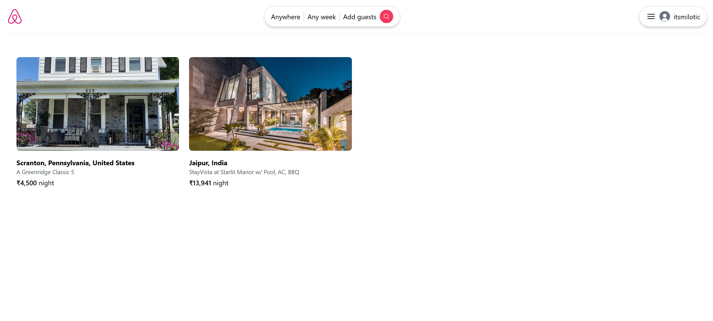
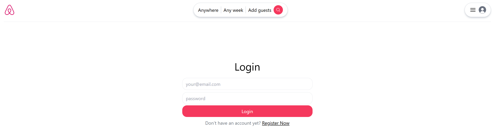
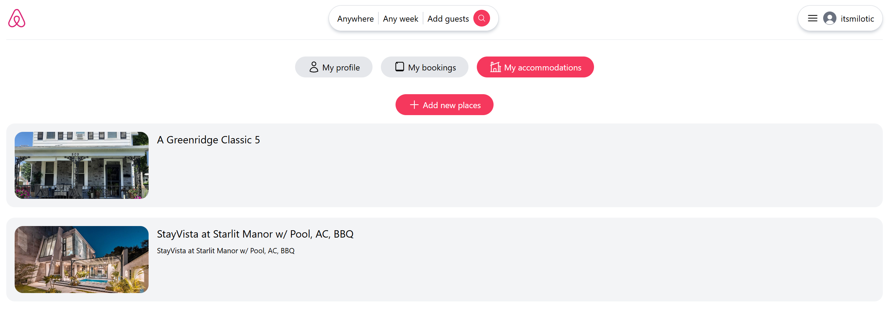
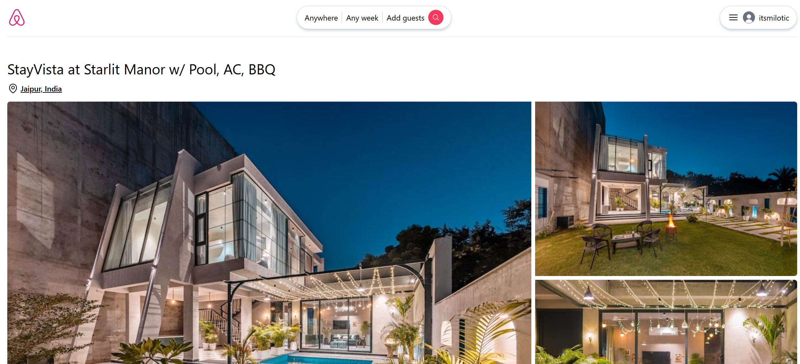
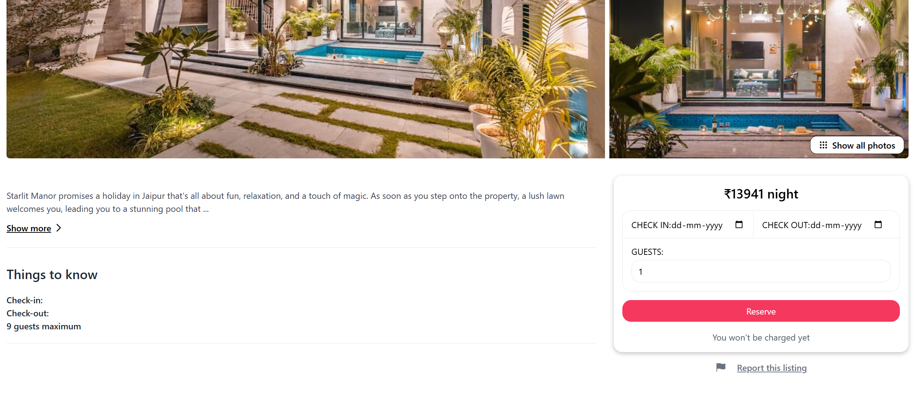

# Airbnb Clone (MERN Stack) 🏠

A full-stack Airbnb clone built using the MERN stack (MongoDB, Express.js, React, Node.js).  
This project is a code showcase demonstrating end-to-end development of a rental booking platform, including user authentication, property listings, and booking functionalities.

> 🚧 **Note:** This project currently serves as a code showcase. The full codebase is available for review.
To run this project fully, ensure you have MongoDB installed locally or configure your own database connection (e.g., MongoDB Atlas) and update the `.env` file accordingly.
---

## 📌 Features

- 🔐 **User Authentication**
  - Sign up, log in, and secure user sessions.
  
- 🏘️ **Property Listings**
  - Add and manage property details.
  - View property details including images, descriptions, and pricing.

- 📅 **Booking System**
  - Book properties for selected dates (backend logic ready).
  
- 📱 **Responsive Design**
  - Fully responsive for desktop and mobile devices.

- ⚙️ **Scalable Architecture**
  - Cleanly structured backend with scalable routing and controllers.
  - Frontend built with React for dynamic rendering.

---

## 📸 Screenshots

### 🏠 Homepage


### 🔑 Login Page


### 🏘️ Property Listings Page


### 🏡 Property Details Page



### 📝 Booking Form Page


### 📱 Mobile UI


---

## 🛠️ Tech Stack

- **Frontend:** React.js, Tailwind
- **Backend:** Node.js, Express.js
- **Database:** MongoDB (connection configured but not deployed)
- **Authentication:** JWT, bcrypt
- **Version Control:** Git, GitHub

---

## 🚀 Getting Started (Local Setup)

To run this project locally:

1. **Clone the repository**
   ```bash
   git clone https://github.com/Itsmilotic/Airbnb-Clone.git
   cd Airbnb-Clone
